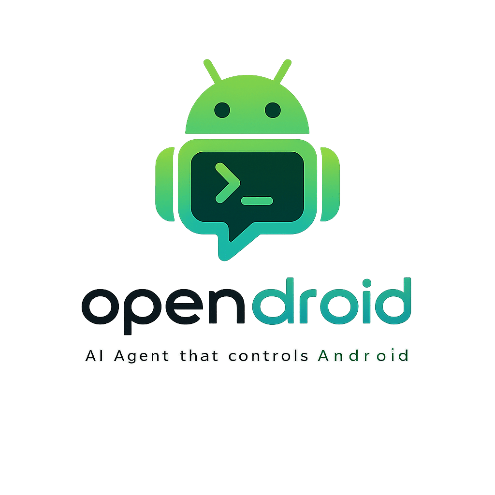
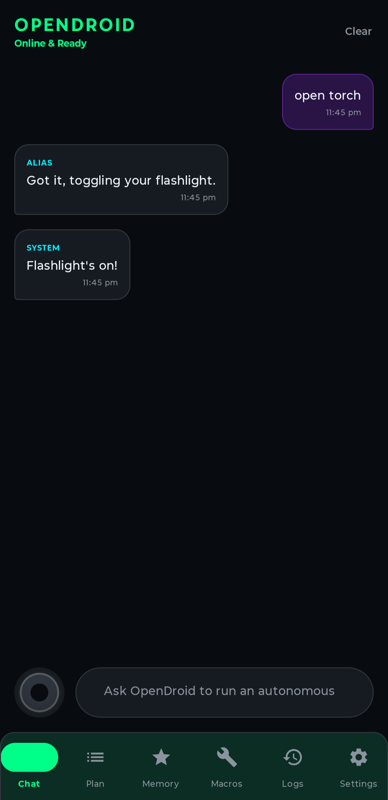
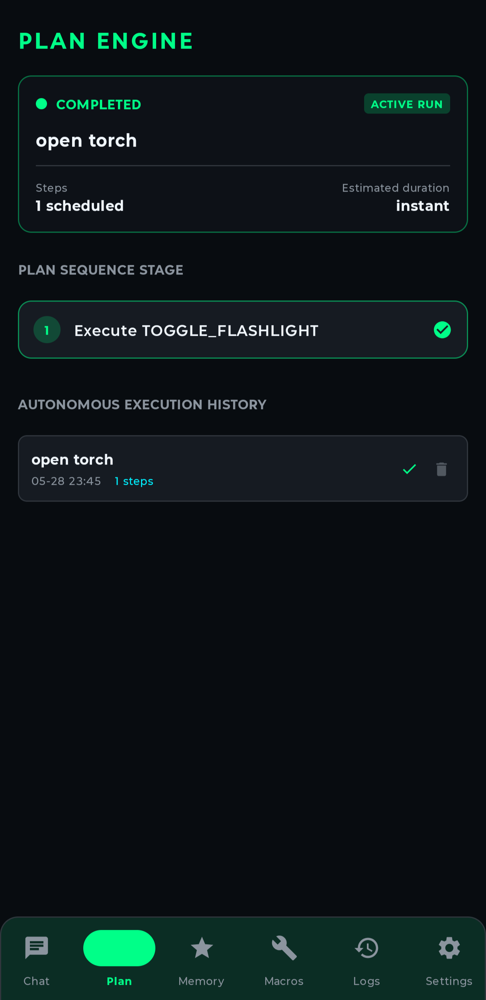
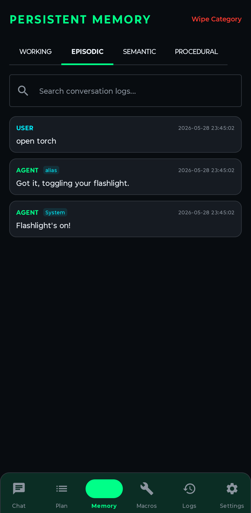
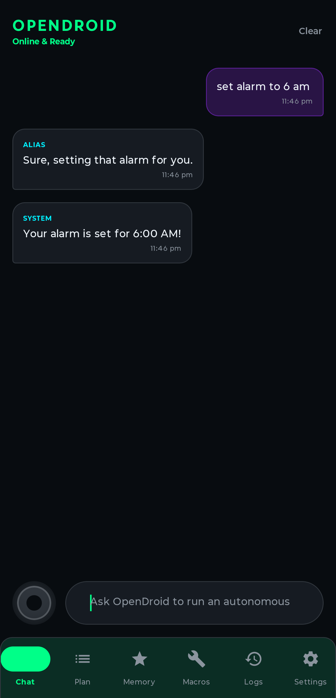

<p align="center">
  
</p>

<h1 align="center">OpenDroid</h1>

<p align="center">
  <strong>🤖 The Open-Source Autonomous AI Agent for Android</strong>
</p>

<p align="center">
  <em>Your phone. Your rules. Your AI.</em>
</p>

<p align="center">
  <a href="https://github.com/yashab-cyber/opendroid/releases"></a>
  <a href="https://github.com/yashab-cyber/opendroid/stargazers"></a>
  <a href="https://github.com/yashab-cyber/opendroid/blob/main/LICENSE"></a>
  <a href="https://discord.gg/knRMyFmvpp"></a>
</p>

<p align="center">
  <a href="#-features">Features</a> •
  <a href="#-architecture">Architecture</a> •
  <a href="#%EF%B8%8F-getting-started">Get Started</a> •
  <a href="#-supported-llm-providers">Providers</a> •
  <a href="#-donate">Donate</a> •
  <a href="#-license">License</a>
</p>

---

## 🎯 What is OpenDroid?

OpenDroid isn't just another chatbot. It's a **fully autonomous AI agent** that lives on your Android phone and actually *does things* for you.

> *"Check if it's going to rain tomorrow, and if so, text my wife that I'll be late and set an alarm for 6 PM."*

OpenDroid will **plan** this as 3 steps, **execute** each one, **verify** the results, and **adapt** if anything fails — all without you lifting a finger.

---

## ✨ Features

### 🧠 Autonomous Agent Engine
| Capability | Description |
|------------|-------------|
| **Self-Planning** | Breaks complex commands into sequential steps with dependency tracking |
| **Re-Evaluation** | Monitors execution results and dynamically replans when steps fail |
| **Compound Intent Guard** | Smart detection of multi-action commands (e.g. "open WhatsApp *and* send message") |
| **Contact Disambiguation** | 4-tier contact resolution with fuzzy matching and relationship aliases ("call dad") |

### 📱 Full Device Control
| Action | Examples |
|--------|----------|
| **System** | Brightness, WiFi, Bluetooth, Flashlight, DND, Volume, Screenshot |
| **Communication** | Calls, SMS, WhatsApp messages, Email drafts |
| **Productivity** | Alarms, Timers, Reminders, Calendar events, Notes |
| **Navigation** | Google Maps directions, Uber/Ola booking |
| **Media** | Play/pause music, YouTube search, camera |
| **Finance** | UPI payments, bill splitting, currency conversion |
| **Smart Home** | Google Home device control |

### 👁️ Vision Engine
Captures screenshots via Accessibility API and feeds them to vision-capable LLMs for real-time screen analysis. Falls back to accessibility tree text-scraping on older devices.

### 🗄️ Multi-Tier Memory System

```
┌─────────────────────────────────────────────────┐
│                  Memory System                   │
├──────────────┬──────────────┬───────────────────┤
│   Working    │   Episodic   │     Semantic      │
│  (current    │ (past task   │ (long-term facts  │
│   context)   │   results)   │  & preferences)   │
├──────────────┴──────────────┴───────────────────┤
│              Procedural Memory                   │
│         (user-defined macro workflows)           │
└─────────────────────────────────────────────────┘
```

### 🎙️ Voice Interface
- **Offline wake word** detection — say *"OpenDroid"* to activate
- **Speech-to-text** for hands-free commands
- **Text-to-speech** with ElevenLabs premium voice support

### 🎨 Premium UI
Built with **Jetpack Compose** featuring a futuristic glassmorphic design:
- Deep navy (`#080C10`) + Neon green (`#00FF88`) color system
- Pulsing audio orb animation during listening
- Live latency benchmarks for each provider
- Dark mode by default

### 🎬 Meet OpenDroid in 3D

<p align="center">
  
</p>

<p align="center">
  <em>OpenDroid saying hi — rendered in 3D!</em>
</p>

> **Note:** If the video doesn't play inline on GitHub, [click here to download and watch it](assets/gemini_generated_video_90af62cc.mp4).

### 📸 Screenshots

<p align="center">
  
  &nbsp;&nbsp;
  
  &nbsp;&nbsp;
  
  &nbsp;&nbsp;
  
</p>

<p align="center">
  <em>Chat &bull; Plan Engine &bull; Memory System &bull; Alarm Control</em>
</p>

---

## 🏗️ Architecture

Clean architecture with **Dagger-Hilt** dependency injection:

```
com.opendroid.ai
│
├── 🤖 accessibility/      App automators (WhatsApp, SMS, Calls)
├── ⚡ actions/             60+ action executors across 10 modules
├── 🧠 core/
│   ├── agent/              AgentLoop, PlanManager, IntentClassifier, VisionEngine
│   ├── llm/                12 LLM providers, fallback chain, prompt engine
│   ├── memory/             4-tier memory system + notification intelligence
│   ├── security/           Encrypted SharedPreferences (EncryptedSharedPreferences)
│   ├── service/            Foreground service, notification listener, boot receiver
│   └── voice/              Wake word, speech recognition, TTS engine
│
├── 💾 data/
│   ├── db/                 Room database (7 DAOs, 7 entities, 3 migrations)
│   ├── models/             Unified data models (Plan, Memory, ChatMessage)
│   └── repository/         Repositories backed by Room & DataStore
│
├── 💉 di/                  Hilt modules (App, Database, LLM)
└── 🎨 ui/
    ├── theme/              Glassmorphic design system
    ├── screens/            16 screens (Chat, Plan, Memory, Settings, etc.)
    ├── viewmodel/          8 ViewModels
    └── components/         Reusable Compose components
```

---

## 🔌 Supported LLM Providers

OpenDroid supports **12 LLM providers** with automatic failover:

| Provider | Models | Type |
|----------|--------|------|
| 🟢 **Google Gemini** | Gemini 2.0 Flash, Pro, Nano | Cloud + On-device |
| 🟣 **Anthropic Claude** | Claude Sonnet 4, Opus 4 | Cloud |
| 🔵 **OpenAI** | GPT-4o, GPT-4.1, o3 | Cloud |
| ⚡ **Groq** | LLaMA 3, Mixtral (ultra-fast) | Cloud |
| 🔷 **DeepSeek** | DeepSeek V3, R1 | Cloud |
| 🟠 **Mistral AI** | Mistral Large, Medium | Cloud |
| 🌐 **OpenRouter** | 200+ models via unified API | Cloud |
| 🤝 **Together AI** | Open-source model hosting | Cloud |
| 🔴 **Cohere** | Command R+ | Cloud |
| 🐙 **GitHub Copilot** | GPT-4.1, Claude via Copilot API | Cloud |
| 🏠 **Ollama** | Any local model (LLaMA, Phi, etc.) | Local |
| 🔧 **Custom OpenAI** | Any OpenAI-compatible endpoint | Self-hosted |

> **Smart Fallback**: If your primary provider fails, OpenDroid automatically tries the next available provider in the chain.

---

## ⚡️ Getting Started

### Prerequisites
- **JDK 17+**
- **Android SDK 34** (Android 14)

### Build & Install

```bash
# Clone the repository
git clone https://github.com/yashab-cyber/opendroid.git
cd opendroid

# Build debug APK
./gradlew assembleDebug

# APK output location
# → app/build/outputs/apk/debug/app-debug.apk
```

### Required Permissions

On first launch, OpenDroid will guide you through granting:

| Permission | Why |
|------------|-----|
| 🔓 **Accessibility Service** | UI automation, screen reading, app control |
| ⚙️ **Write Settings** | Toggle WiFi, Bluetooth, brightness |
| 🎤 **Record Audio** | Wake word detection & voice commands |
| 🔔 **Notification Access** | Smart notification reading & auto-reply |
| 📱 **Post Notifications** | Foreground service status |

### Configure LLM

In **Settings**, add your API key for any supported provider. OpenDroid works best with:
- **Gemini** (free tier available)
- **Groq** (fastest inference)
- **Ollama** (fully offline)

---

## 💚 Donate

OpenDroid is free, open-source, and maintained by a solo developer. If it's helped you, consider supporting the project!

**UPI (India):** `8960457971`
**Email:** `yashabalam707@gmail.com`

[→ See DONATE.md for more ways to support](DONATE.md)

---

## 🤝 Contributing

Contributions are welcome! See [CONTRIBUTING.md](CONTRIBUTING.md) for guidelines.

1. Fork the repo
2. Create your feature branch (`git checkout -b feature/amazing-feature`)
3. Commit your changes (`git commit -m 'Add amazing feature'`)
4. Push to the branch (`git push origin feature/amazing-feature`)
5. Open a Pull Request

---

## 🔒 Security

Found a vulnerability? Please report it responsibly.
See [SECURITY.md](SECURITY.md) for details.

---

## 📜 License

```
Copyright 2026 OpenDroid Contributors

Licensed under the Apache License, Version 2.0 (the "License");
you may not use this file except in compliance with the License.
You may obtain a copy of the License at

    http://www.apache.org/licenses/LICENSE-2.0

Unless required by applicable law or agreed to in writing, software
distributed under the License is distributed on an "AS IS" BASIS,
WITHOUT WARRANTIES OR CONDITIONS OF ANY KIND, either express or implied.
See the License for the specific language governing permissions and
limitations under the License.
```

---

<p align="center">
  Made with ❤️ by <a href="https://github.com/yashab-cyber"><strong>Yashab Alam</strong></a>
</p>

<p align="center">
  <a href="https://github.com/yashab-cyber/opendroid">⭐ Star this repo</a> if OpenDroid has helped you!
</p>
