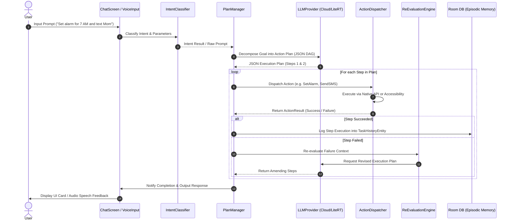
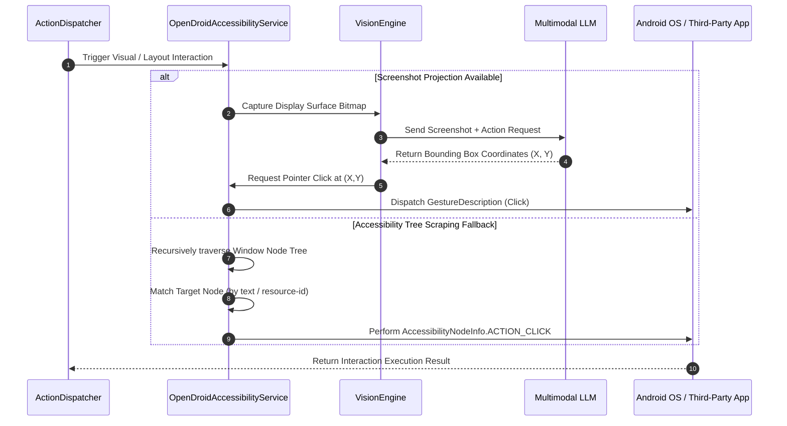
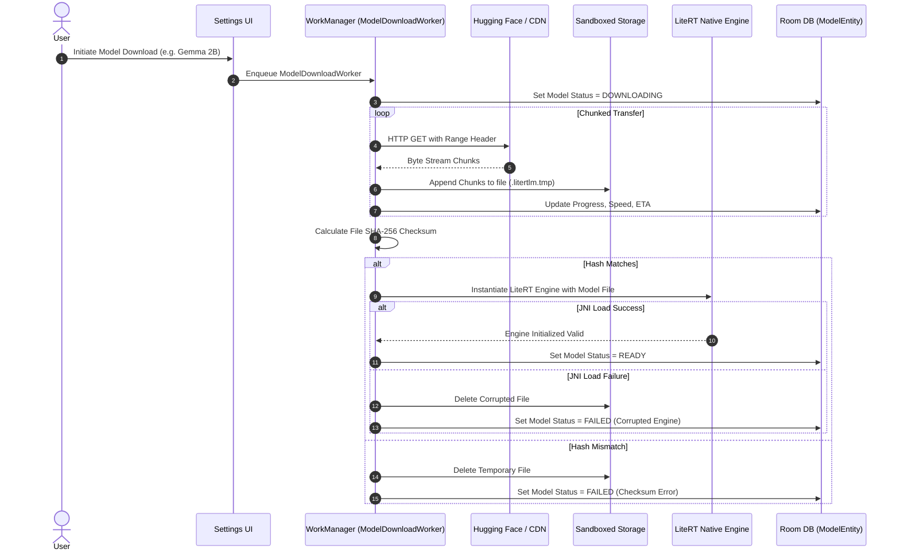

# System Architecture & Solution Design - OpenDroid

This document provides a comprehensive architectural breakdown, solution design, infrastructure scaling strategy, technical stack specification, data flows, and API contracts for **OpenDroid** — a production-ready, autonomous, self-planning AI agent for Android devices.

---

## 1. Architectural Overview & Design Principles

OpenDroid is engineered following strict **Clean Architecture** principles, maintaining a decoupled, testable, and maintainable codebase. The architecture is organized into three primary layers: **Presentation Layer**, **Domain/Core Layer**, and **Data Layer**, with modular action dispatchers and accessibility services operating at system boundaries.

```
                      ┌─────────────────────────────────┐
                      │       Presentation Layer        │
                      │  (Compose Screens, ViewModels)  │
                      └────────────────┬────────────────┘
                                       │ StateFlow & UI Events
                                       ▼
                      ┌─────────────────────────────────┐
                      │          Domain Layer           │
                      │  (PlanManager, AgentLoop, Core) │
                      └────────────────┬────────────────┘
                                       │ Interfaces & Use Cases
                                       ▼
                      ┌─────────────────────────────────┐
                      │           Data Layer            │
                      │ (Room DB, DataStore, API Client)│
                      └─────────────────────────────────┘
                                       │ System Drivers & Services
                                       ▼
                      ┌─────────────────────────────────┐
                      │   Accessibility & Native Actions│
                      │(OpenDroidAccessibilityService)  │
                      └─────────────────────────────────┘
```

### Core Design Principles
1. **Privacy-First & Sandboxed Execution:** All sensitive credentials (API keys, HF tokens) use Android `EncryptedSharedPreferences` backed by Hardware KeyStore via [`SecurePrefs.kt`](file:///workspaces/opendroid/app/src/main/java/com/opendroid/ai/core/security/SecurePrefs.kt). System actions and scrapers operate locally on device.
2. **Autonomous Agentic Loop:** Implements self-evaluation, error detection, and dynamic re-planning using LLM re-evaluators when an execution step fails.
3. **Hybrid Inference Pipeline:** Seamless support for cloud LLM providers (OpenAI, Anthropic, Gemini, DeepSeek, OpenRouter) and local on-device inference engines (LiteRT-LM, Ollama, ML Kit GenAI).
4. **Resilient System Interactivity:** Native Android APIs are prioritized; when direct permissions are missing, OpenDroid automatically falls back to UI Intents or Accessibility node tree manipulation.

---

## 2. Solution Design

### 2.1. System Core Components

* **`PlanManager` & `AgentLoop`:** The central reasoning engines. `PlanManager` decomposes multi-step user prompts into structured DAG action plans, while `AgentLoop` sequences step execution and manages state transitions.
* **`ReEvaluationEngine`:** Monitors step execution results (`ActionResult`). On failure or unexpected application behavior, it invokes the LLM with context feedback to dynamically amend or regenerate remaining plan steps.
* **`ActionDispatcher` & Action Handlers:** Dispatches parsed plan step calls to concrete action handlers (`SystemActions`, `CommunicationActions`, `CalendarActions`, `MediaActions`, `AdvancedControlActions`, etc.).
* **`VisionEngine` & Accessibility Scraper:** `VisionEngine` captures screen state via Android Media Projection (Android 11+) and processes visual frames via multimodal LLMs. The node scraper in `OpenDroidAccessibilityService` recursively parses accessibility window node trees (`AccessibilityNodeInfo`) as text fallback.
* **`OpenDroidNotificationListener` & `AutoReplyEngine`:** Intercepts incoming device notifications, matches automated trigger rules, and dispatches context-aware AI auto-responses for platforms like WhatsApp or SMS.
* **`SecurePrefs`:** Encrypts local key-value configurations using AES256-SIV data keys and AES128-ECB index keys backed by Android's `MasterKey`.

### 2.2. Component Interaction & Scoping
* **UI to Engine Communication:** ViewModels expose read-only `StateFlow<UiState>` models to Jetpack Compose components. User commands are dispatched as asynchronous coroutines via `viewModelScope`.
* **Domain to Data Mapping:** Domain services interact solely with Repository interfaces (`NotificationRepository`, `MacroRepository`, etc.), isolating SQLite storage and network serialization details.
* **Service Scoping:** `OpenDroidAccessibilityService` and `OpenDroidNotificationListener` run as system-bound background services, communicating with the core engine via Kotlin `SharedFlow` and Dagger-Hilt singletons.

---

## 3. Infrastructure & Scaling Strategy

### 3.1. On-Device Resource & Memory Scaling
* **Thread Dispatcher Scoping:** Memory-heavy layout tree traversals, database transactions, and model IO operations are strictly assigned to `Dispatchers.IO` thread pools to prevent blocking the UI looper thread (`Dispatchers.Main`).
* **Bitmap Lifecycle Management:** Screenshot image capture in `VisionEngine` recycles bitmap buffers immediately post-inference to maintain heap usage within strict operating limits.
* **Battery & Execution Efficiency:** WakeLocks are acquired only during active voice listening or background action execution, ensuring zero battery drain during idle state.

### 3.2. Background Model Downloader Infrastructure
For offline LiteRT-LM execution (`.task` / `.litertlm` formats), OpenDroid implements a robust downloading and verification infrastructure:
* **WorkManager Orchestration:** `ModelDownloadWorker` manages downloads asynchronously, remaining resilient against app closures or process kills.
* **HTTP Range Resumption:** Uses OkHttp chunked streaming supporting HTTP `Range` headers to resume interrupted model downloads seamlessly without re-downloading existing chunks.
* **Hugging Face CDN & Auth Integration:** Authenticates gated models via `EncryptedSharedPreferences` token integration, querying Hugging Face's `whoami-v2` API before initiating transfers.
* **Integrity & Compatibility Verification Pipeline:**
  1. File size pre-validation against remote headers.
  2. Streaming SHA-256 hash checksum calculation post-download.
  3. LiteRT Engine JNI test instantiation (`NativeEngine.init`) to verify binary runtime compatibility prior to marking status as `ModelStatus.READY`.

### 3.3. Multi-Tier Memory Storage Infrastructure
OpenDroid organizes memory across four distinct tiers:
1. **Working Memory:** In-memory volatile `StateFlow` managing active step status and context.
2. **Episodic Memory:** Room SQLite tables (`NotificationEntity`, `TaskHistoryEntity`) recording full action histories.
3. **Semantic Memory:** Room SQLite table (`SemanticFactEntity`) holding extracted personal facts.
4. **Procedural Memory:** Room SQLite table (`MacroEntity`) storing user-defined automation macro blueprints.

### 3.4. External LLM API Reliability & Rate Limiting
* **Exponential Backoff & Retries:** Cloud network requests implement OkHttp interceptors enforcing maximum 15-second timeouts and exponential backoff retry algorithms for `HTTP 429` (Rate Limited) and `5xx` server errors.
* **Provider Fallback:** In multi-provider configurations, if a primary cloud endpoint fails, OpenDroid seamlessly routes the prompt to secondary cloud providers or local LiteRT engines.

---

## 4. Technical Stack Details

| Category | Technology / Library | Version | Role in Architecture |
|:---|:---|:---|:---|
| **Language & SDK** | Kotlin / Android SDK | Kotlin 2.4.0 / SDK 35 (Min SDK 26) | Core application runtime and language standard |
| **UI Framework** | Jetpack Compose BOM | 2026.06.01 | Declarative reactive UI with Cyberpunk Design System |
| **Architecture** | Clean Architecture + MVVM | - | Strict separation of UI, Domain, Data, and System Layers |
| **Dependency Injection** | Dagger-Hilt | 2.58 | Centralized dependency graph and scope management |
| **Local Database** | Room DB (SQLite) | 2.8.4 | Multi-tier persistent memory storage |
| **Key-Value Storage** | DataStore Preferences | 1.1.1 | Reactive user settings management |
| **Security & Key Encryption** | Jetpack Security Crypto | 1.1.0-alpha06 | KeyStore-backed `EncryptedSharedPreferences` ([`SecurePrefs.kt`](file:///workspaces/opendroid/app/src/main/java/com/opendroid/ai/core/security/SecurePrefs.kt)) |
| **Local On-Device AI** | LiteRT-LM Android Library | 0.14.0 | Offline LLM inference execution engine (`.task` models) |
| **Google GenAI API** | Google ML Kit GenAI | 1.0.0-beta2 | Device-integrated Gemini Nano prompt API integration |
| **Network & REST API** | OkHttp3 / Retrofit2 | 4.12.0 / 2.9.0 | HTTP client engine, JSON parsing, chunked downloads |
| **Background Processing**| Jetpack WorkManager | 2.9.0 | Resilient background downloads and task scheduling |
| **Serialization** | Kotlinx Serialization | 2.4.0 | Fast, type-safe JSON serialization/deserialization |
| **Voice & Speech Engine** | Android SpeechRecognizer / ElevenLabs API | System Native / REST | Speech-to-Text parsing and natural Text-to-Speech audio synthesis |
| **Image & Animation** | Coil / Lottie Compose | 2.5.0 / 6.3.0 | Image caching and dynamic vector UI micro-animations |
| **Build & Optimization** | Gradle / AGP / R8 Optimizer | 8.10.2 / 8.8.2 / 9.1.31 | Build toolchain, bytecode shrinking, and optimization |

---

## 5. Comprehensive Data Flow Architecture

### 5.1. Natural Language Command Execution & Agentic Loop



### 5.2. Multimodal Vision & Accessibility Automation Data Flow



### 5.3. Background Model Download & Verification Pipeline



---

## 6. API & Interface Specifications

### 6.1. LLM Provider Interface (`LLMProvider`)

Every LLM engine (cloud or local) implements the standard contract defined in [`LLMProvider.kt`](file:///workspaces/opendroid/app/src/main/java/com/opendroid/ai/core/llm/LLMProvider.kt):

```kotlin
interface LLMProvider {
    val id: String
    val name: String
    val isLocal: Boolean

    suspend fun generateCompletion(
        prompt: String,
        systemPrompt: String? = null
    ): Result<String>

    suspend fun fetchModels(): Result<List<AIModel>>
}
```

#### Standardized JSON Payload Contract (OpenAI / Ollama / Cloud API Format)

```json
{
  "model": "gpt-4o-mini",
  "messages": [
    {
      "role": "system",
      "content": "You are OpenDroid Agent. Decompose instructions into JSON step plans."
    },
    {
      "role": "user",
      "content": "Turn on WiFi and set volume to 80%"
    }
  ],
  "temperature": 0.2,
  "response_format": { "type": "json_object" }
}
```

### 6.2. Base Action & Action Result Specification (`Action` / `ActionResult`)

All executable actions adhere to the interface defined in [`Action.kt`](file:///workspaces/opendroid/app/src/main/java/com/opendroid/ai/actions/base/Action.kt) and [`ActionResult.kt`](file:///workspaces/opendroid/app/src/main/java/com/opendroid/ai/actions/base/ActionResult.kt):

```kotlin
interface Action {
    val name: String
    suspend fun execute(params: Map<String, String>, context: Context): ActionResult
}
```

#### `ActionResult` Sealed Representation

```kotlin
@Serializable
sealed class ActionResult {
    abstract val success: Boolean
    abstract val data: String?
    abstract val error: String?

    @Serializable
    data class Success(val dataMap: Map<String, String> = emptyMap()) : ActionResult()

    @Serializable
    data class Failure(val errorMsg: String, val fallback: String = "") : ActionResult()

    @Serializable
    data class UnknownAction(val attemptedAction: String, val availableActions: List<String>) : ActionResult()

    @Serializable
    data class NeedsInput(val question: String, val options: List<String> = emptyList()) : ActionResult()
}
```

### 6.3. Accessibility Node Interaction Interface (`OpenDroidAccessibilityService`)

Used by the agent loop for interacting with layout hierarchies:

```kotlin
class OpenDroidAccessibilityService : AccessibilityService() {
    fun findNodeByTextOrId(query: String): AccessibilityNodeInfo?
    fun performClickOnNode(node: AccessibilityNodeInfo): Boolean
    fun injectTextIntoNode(node: AccessibilityNodeInfo, text: String): Boolean
    fun performGestureClick(x: Float, y: Float): Boolean
    fun captureScreenLayoutTree(): WindowNodeHierarchy
}
```

### 6.4. On-Device Model Downloader Interface (`ModelFetcher` & `ModelDownloadWorker`)

```kotlin
interface ModelManager {
    fun downloadModel(modelId: String, downloadUrl: String, sha256: String?): LiveData<WorkInfo>
    fun deleteModel(modelId: String): Boolean
    suspend fun getAvailableLocalModels(): List<ModelEntity>
}
```

---

## 7. Security Architecture & Permission Guardrails

1. **Hardware KeyStore Encrypted Preference Store:** API keys, access tokens, and confidential server URLs are saved via [`SecurePrefs.kt`](file:///workspaces/opendroid/app/src/main/java/com/opendroid/ai/core/security/SecurePrefs.kt) using `EncryptedSharedPreferences` backed by an Android `MasterKey`.
2. **Runtime Permission Safeguards:** High-privilege permissions (SMS, Phone, Accessibility, Media Projection) require explicit user opt-in during the onboarding flow.
3. **Intent Cascade Fallback:** If high-privilege direct permissions (e.g. `SEND_SMS` or `CALL_PHONE`) are denied by the user, the execution dispatcher degrades gracefully to standard system intent pickers (`Intent.ACTION_SENDTO`, `Intent.ACTION_DIAL`), ensuring zero permission crashes.
4. **Data Transmission Privacy:** Accessibility tree node details and screen frames are never logged to external servers unless explicitly dispatched to the user-configured LLM provider over HTTPS.
