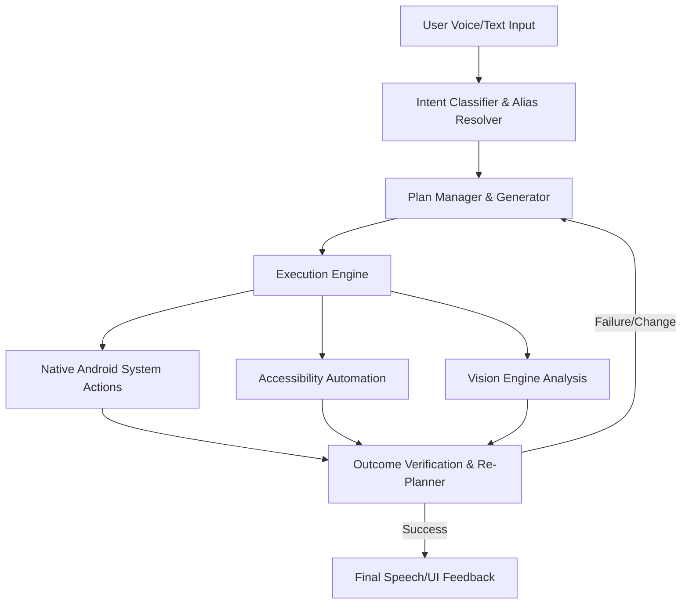

# Product Requirement Document (PRD) - OpenDroid

## Document Control
* **Document Version:** v1.1.0
* **Last Updated:** June 4, 2026
* **Status:** Draft / Approved
* **Author:** yashab-cyber & Antigravity (Google DeepMind Team)

---

## 1. Executive Summary & Vision

OpenDroid is a production-ready, autonomous, self-planning AI agent for Android devices. Unlike standard chat-based AI assistants (such as Google Assistant or Siri) that rely on static, hardcoded APIs or simple keyword matching, OpenDroid operates as a fully autonomous agentic system. 

It interprets high-level natural language user instructions, breaks them down into sequential sub-tasks (a "Plan"), executes those tasks using native system interfaces and screen-based Accessibility actions, evaluates the outcomes, and dynamically adjusts/replans if a step fails or device conditions change.

### The Mission
To build a private, open-source, and fully autonomous agentic layer that gives users hands-free, complete control over their mobile devices using state-of-the-art Large Language Models (LLMs) running both locally (offline) and in the cloud.

---

## 2. Problem Statement & User Pain Points

1. **Fragmented App Ecosystems:** Apps do not talk to each other. Automating a workflow like *"Checking if a flight is delayed, emailing my boss about it, and ordering an Uber to the new time"* requires manually hopping between three separate apps.
2. **Brittle Assistant APIs:** Traditional voice assistants fail when they encounter apps without official developer APIs. They cannot click buttons, scroll feeds, or type into text boxes on third-party layouts.
3. **Privacy Concerns:** Commercial AI assistants process all voice and personal data on remote servers. Users require an assistant that can run completely offline using local models (e.g., Ollama).
4. **Lack of Agentic Loops:** Existing tools cannot handle failure. If a network call fails, or a button isn't visible, they stop. They lack a feedback loop to try an alternative approach or ask for human-in-the-loop confirmation.

---

## 3. Core Features & Capabilities

### 3.1. Autonomous Planning & Re-Evaluation (PlanManager)
* **Goal Decomposition:** Convert multi-step instructions into a structured JSON execution plan (directed acyclic graph of actions).
* **Dynamic Re-planning:** During execution, verify the outcome of each step. If a step fails, the planner regenerates the remaining sequence (e.g., using a fallback method or altering parameters).
* **Safe Intent Guards:** Intercept complex compound phrases (e.g., *"and then text Dad"*) to ensure they are handled by the planning engine rather than single action dispatchers.

### 3.2. Device & System Control Actions
* **Native System Controls:** Adjust screen brightness, volume, Wi-Fi, Bluetooth, flashlight, and device lock state.
* **Productivity:** Set alarms, schedule timers, search/create calendar events, translate text, and fetch real-time device battery/network status.
* **Smart Communications:** Search contacts using phonetic and nickname-matching fallback logic. Draft and send SMS or call contacts directly, falling back to system intents if direct permissions are not granted.

### 3.3. Accessibility & Vision Automation
* **UI Interaction Service (`OpenDroidAccessibilityService`):** Click buttons, inject text, scroll list containers, and navigate layouts in third-party apps (e.g., WhatsApp, Maps).
* **Multimodal Vision Engine:** Capture real-time screenshots using the Accessibility media projections (Android 11+) and feed them to vision-capable models (e.g., Gemini Flash) for layout and step verification.
* **Text-Scraping Fallback:** On older devices or where screenshot permissions are missing, scrape the active window's node hierarchy tree to reconstruct layout state.

### 3.4. Multi-Tier Persistent Memory System
The agent utilizes a four-layered memory structure backed by SQLite (Room Database) and DataStore Preferences:

| Memory Tier | Purpose | Backend Store |
|:---|:---|:---|
| **Working Memory** | Manages transient variables and state of the current plan | Kotlin StateFlow / Volatile State |
| **Episodic Memory** | Stores a structured log of past execution steps and outcomes | Room DB (`NotificationEntity`, `Logs`) |
| **Semantic Memory** | Extracted personal facts (e.g., "wife's name is Sarah") mined via LLM | Room DB (`SemanticFactEntity`) |
| **Procedural Memory** | User-defined macro sequences (e.g., "morning routine") | Room DB (`MacroEntity`) |

### 3.5. On-Device Model Downloader & Manager (LiteRT-LM)
* **Background Downloading**: Support downloading fully offline LiteRT models (`.task`/`.litertlm` formats) in the background via Jetpack WorkManager. The downloader must support pausing, resuming (with HTTP Range headers), and canceling.
* **Hugging Face Authentication**: Enable secure downloading of both public and gated models. Implement a Hugging Face Access Token manager stored in Android's KeyStore-backed `EncryptedSharedPreferences`. Provide verification via the `whoami-v2` endpoint.
* **Integrity & Compatibility Verification**: Before marking a model as ready for inference, verify that the downloaded file size matches expectations, check the SHA-256 hash (if defined), and ensure the file can be opened and initialized by the LiteRT runtime engine. If verification fails, delete the corrupted file and report the error.
* **Local Model Import**: Allow users to bypass downloading by importing custom local `.task` or `.litertlm` files, copying them to sandboxed storage, and running the same JNI compatibility validation checks.

---

## 4. User Interface & Design Requirements

The user interface follows a **Premium Glassmorphic Cyberpunk** aesthetic.

* **Color Palette:**
  * Background: Deep Space Navy (`#080C10`)
  * Accent / Highlights: Neon Green (`#00FF88`), Cyber Cyan (`#00E5FF`), Electric Violet (`#8B5CF6`)
  * Surfaces: Dark Gray Cardboard (`#121820`) with semi-transparent borders.
* **Key Screen Mockups & Flows:**
  1. **Chat Screen:** Futuristic messaging interface containing a pulsing visual indicator (audio orb) when active in voice-listening mode. Displays real-time API latency benchmarks.
  2. **Plan Screen:** Displays the step-by-step decomposed plan, showing icons representing action types, progress spinners for running steps, green ticks for completed tasks, and red exclamation marks for failed steps.
  3. **Settings Screen:** Simple, unified panel to toggle providers (OpenAI, Gemini, Ollama, etc.), save encrypted API keys, customize Ollama host URLs, and test latency.
  4. **Auto-Reply Setup:** Configurable auto-responder for WhatsApp/SMS with a prominent warning card and observer that updates live as accessibility permissions are granted.

---

## 5. Security & Permission Management

Because OpenDroid operates with high-privilege permissions, security is treated as a first-class requirement.

> [!IMPORTANT]
> **Data Security Requirement:** API Keys must not be stored in standard `SharedPreferences` in plaintext. They must be saved using Android's jetpack `Security-Crypto` (EncryptedSharedPreferences) backed by KeyStore keys.

> [!CAUTION]
> **Accessibility Service Warning:** The accessibility service handles highly sensitive user data. Under no circumstances should layout hierarchies, scraped texts, or screenshots be sent to third-party endpoints unless explicitly authorized by the active LLM provider configuration. All transmission must be encrypted via HTTPS.

### Permissive Onboarding flow
The onboarding screen must implement a vertical scroll container that handles rotation gracefully. The stages of onboarding include:
1. **Introduction Panel:** Personal name and birthday setup.
2. **Permissions Setup Panel:** Guides the user sequentially to grant:
   * Record Audio (Speech-to-Text)
   * Fine Location (Productivity actions)
   * SMS & Phone Call (Communications actions)
   * Contacts & Calendar (Productivity actions)
   * External Storage / File Manager (File read/write)
   * Write Settings (System control)
   * Accessibility Service (Automation)

---

## 6. Technical Stack & Dependencies

* **Core Platform:** Kotlin, Jetpack Compose, Jetpack Lifecycle
* **Dependency Injection:** Dagger-Hilt
* **Database:** Room DB (SQLite)
* **Local Settings:** DataStore Preferences
* **Serialization:** Kotlinx Serialization JSON
* **Network Client:** OkHttp3 & Retrofit2
* **Voice Engine:** Android native SpeechRecognizer, offline WakeWord engines, and ElevenLabs API
* **Minimum SDK:** Android 26 (Android 8.0 Oreo)
* **Target SDK:** Android 35 (Android 15)

---

## 7. Success Criteria & Verification Metrics

1. **Zero-Crash Navigation:** Navigating to settings, auto-reply configurations, and history screens must be free of asynchronous runtime failures.
2. **Layout Adaptability:** The app must be fully functional and readable under both portrait and landscape screen configurations.
3. **Execution Success Rate:** Over 90% of native system commands (Wi-Fi toggle, Brightness, Alarm set) must execute within 2.5 seconds of user input.
4. **Fallback Resilience:** Phone calls and SMS must successfully trigger standard system Intent overlays if direct runtime permissions are missing.
