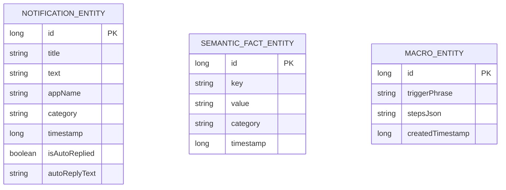

# Technical Requirement Document (TRD) - OpenDroid

## Document Control
* **Document Version:** v1.1.0
* **Last Updated:** June 4, 2026
* **Status:** Draft / Approved
* **Author:** yashab-cyber & Antigravity (Google DeepMind Team)

---

## 1. System Architecture

OpenDroid is structured according to **Clean Architecture** principles. The codebase is decoupled into three primary layers: Presentation, Domain (Core), and Data. Dependency injection is managed globally via Dagger-Hilt.

```
                  ┌─────────────────────────┐
                  │   Presentation Layer    │
                  │   (Jetpack Compose UI)  │
                  └────────────┬────────────┘
                               │ (State & Events)
                               ▼
                  ┌─────────────────────────┐
                  │    Domain/Core Layer    │
                  │ (PlanManager, Agent,    │
                  │  Accessibility Service) │
                  └────────────┬────────────┘
                               │ (Repositories & Interfaces)
                               ▼
                  ┌─────────────────────────┐
                  │       Data Layer        │
                  │  (Room DB, DataStore,   │
                  │   Retrofit, OkHttp)     │
                  └─────────────────────────┘
```

### 1.1. Core Components

* **PlanManager & ReEvaluationEngine:** The central orchestrator of agent actions. It is responsible for calling the LLM provider to decompose high-level commands, keeping track of plan execution status, and performing dynamic re-evaluation if a task fails.
* **OpenDroidAccessibilityService:** Captures real-time screen events, scrapes active window nodes, and executes gestures (clicks, scrolls, typing) inside third-party applications.
* **ActionDispatcher:** Routes plan steps to specific action classes:
  * `SystemActions`: Adjust volume, brightness, toggles.
  * `CommunicationActions`: Place calls, draft/send SMS, fetch contact information.
  * `ProductivityActions`: Schedule timers, alarms, and manage calendar events.
* **ModelFetcher:** Queries configured LLM endpoints to retrieve list of active models.

---

## 2. Database Schema & Models

OpenDroid utilizes a local SQLite database managed via Android's Room DB library.

### 2.1. Room Entities



* **NotificationEntity:** Logs system notifications captured by the notification listener service.
* **SemanticFactEntity:** Stores long-term user context extracted from chat logs (e.g. name, preferences).
* **MacroEntity:** Stores user-recorded automation sequences (macros).
* **ModelEntity:** Tracks downloaded LiteRT-LM models, including local file path, installation timestamps, download progress (0..100), speed, ETA, and state status (`ModelStatus`).

---

## 3. Detailed Component Technical Details

### 3.1. Accessibility Service & UI Scraper
* **Node Scraping Fallback:** Scrapes the accessibility window hierarchical tree recursively. Matches elements by `resource-id`, `content-description`, or `text`.
* **Action Injection:** Uses `AccessibilityNodeInfo.ACTION_CLICK`, `ACTION_SCROLL_FORWARD`, or gesture dispatching (`GestureDescription`) for high-precision pointer automation.

### 3.2. Communications Fallback Mechanism
When initiating communication (calls/SMS), the agent executes the following cascade:
1. **Direct Mode (Permissions granted):** Executes direct programmatic calls (`TelephonyManager`/`SmsManager`).
2. **Intent Fallback (Permissions missing):** Fires system intents (`Intent.ACTION_DIAL`, `Intent.ACTION_SENDTO`) with pre-populated phone numbers/messages, overlaying the native system composer over the UI.

### 3.3. Secure Storage
All sensitive settings (e.g. OpenAI/Anthropic/ElevenLabs API keys, Hugging Face Access Tokens) are stored securely:
* **Storage Backend:** `EncryptedSharedPreferences` (managed via `SecurePrefs.kt`)
* **Encryption Scheme:** AES256-SIV-HMAC-SHA256 for data and AES128-ECB for keys, managed through Android's system `MasterKey`.

### 3.4. Background Model Downloader (WorkManager)
* **ModelDownloadWorker**: Implements background downloading via OkHttp. Features:
  * Chunk-based byte copying with active cancellation checks (mapping to worker stop signals).
  * Real-time transfer speed calculation and ETA estimation.
  * SHA-256 checksum validation.
  * LiteRT engine instantiation compatibility checks using JNI engine bindings to verify download integrity before marking READY.

---

## 4. API & Integration Specs

### 4.1. LLM Client Integration
Every LLM provider implements a unified `LLMProvider` interface:

```kotlin
interface LLMProvider {
    suspend fun generateCompletion(prompt: String, systemPrompt: String?): Result<String>
    suspend fun fetchModels(): Result<List<AIModel>>
}
```

Standardized REST endpoints used for integrations:
* **OpenAI / Custom OpenAI:** `https://api.openai.com/v1/chat/completions`
* **Anthropic Claude:** `https://api.anthropic.com/v1/messages`
* **Ollama (Local/Offline):** `${ollamaUrl}/api/generate` or `/v1/chat/completions`

---

## 5. Non-Functional Technical Requirements

### 5.1. Performance & Latency
* **Local Parsing:** Intent classification should complete within 300ms using local regex and light heuristics.
* **ViewModel Threading:** All database reads and file system write operations must occur on `Dispatchers.IO` to prevent UI thread blocks.
* **Network Timeout:** Client connections must enforce a maximum 15-second write/read/connect timeout.

### 5.2. Safety Constraints & Error Boundaries
* **Debouncing Input:** Auto-saving input fields (API keys, URLs) must debounce keystrokes by 1000ms.
* **Exception Containment:** File system writes must use `try-catch` blocks to prevent crash propagation if the disk is full or database locks occur.

---

## 6. Project Dependencies & Toolchain Versions

### 6.1. Build Toolchain
* **Gradle Version:** `8.10.2`
* **Android Gradle Plugin (AGP):** `8.8.2`
* **Kotlin Compiler / Gradle Plugin:** `2.4.0`
* **Compose Compiler Plugin:** `2.4.0`
* **Kotlin Serialization Plugin:** `2.4.0`
* **Dagger / Hilt Gradle Plugin:** `2.58`
* **R8 Optimizer:** `9.1.31`
* **Target Android SDK:** `35`
* **Minimum Android SDK:** `26`

### 6.2. Key Libraries & Frameworks
* **On-Device Inference Engines:**
  * **LiteRT-LM Android Library:** `com.google.ai.edge.litertlm:litertlm-android:0.14.0`
  * **Google ML Kit GenAI Prompt API (AI Core):** `com.google.mlkit:genai-prompt:1.0.0-beta2`
* **Dependency Injection:**
  * **Dagger-Hilt:** `2.58`
* **Local Database:**
  * **Room DB:** `2.8.4` (utilizing Kapt annotation processing with `kotlin-metadata-jvm:2.4.0` metadata support)
* **Background Scheduling:**
  * **WorkManager:** `2.9.0`
* **Networking Client:**
  * **OkHttp & Logging Interceptor:** `4.12.0`
  * **Retrofit & Converter Gson:** `2.9.0`
* **Security & Cryptography:**
  * **Jetpack Security Crypto (EncryptedSharedPreferences):** `1.1.0-alpha06`
* **User Interface:**
  * **Jetpack Compose BOM:** `2026.06.01`
  * **Lifecycle & ViewModel Compose Extensions:** `2.8.7`
  * **Activity Compose:** `1.9.3`
  * **Coil (Image Loading):** `2.5.0`
  * **Lottie Animations:** `6.3.0`

